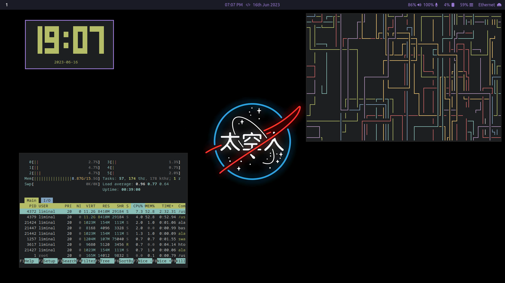

# Userdots
This directory contains all the necessary files for setting the desktop to my liking.
There is a script included for quick setup.

Main Programs Used:

Sway   - Window Manager

Waybar - Top Bar

Fuzzel - Application Launcher

# Prerequisites :-
AMD GPU should be used instead of NVIDIA.
You can Run the required_packages.sh script to update & install all the necessary packages for this setup to function.

# Installation :-
Clone this Repo.

Enter the Repo Directory.

Make the Script Executable and then launch the Script.

You're Done !
